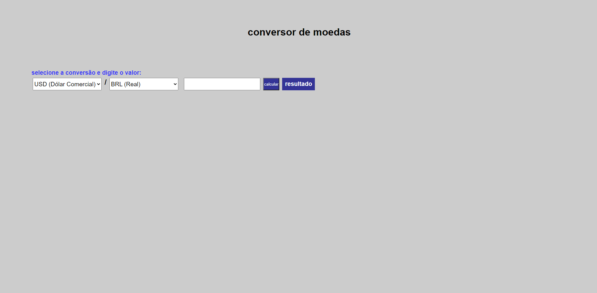
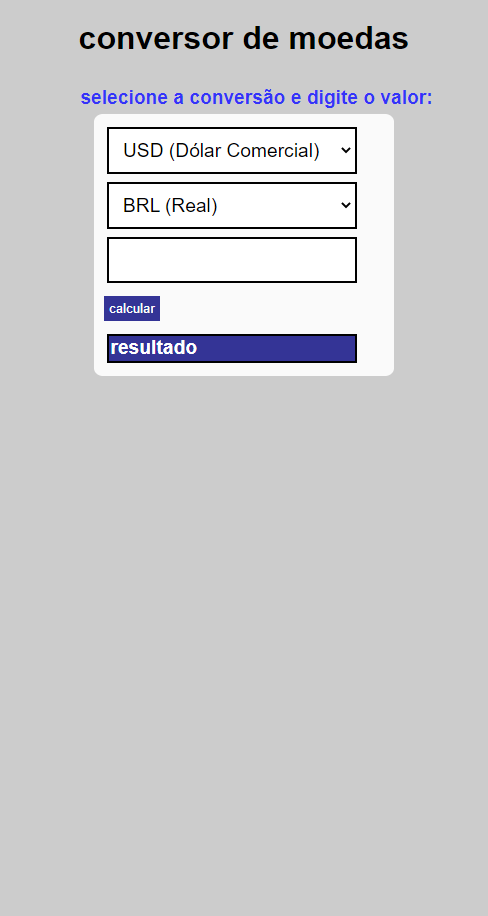

# conversor de moedas

<a href="https://vilmar-moreira-souza.github.io/Conversor-de-moedas/" target="blank">visualizar</a>

<h2>desktop</h2>

<h2>mobile</h2>

 

<h3>sobre a aplicação</h3>

essa aplicação é um pagina para conversaõ de moedas, a base de dados é atualizada a cada 30 segundos <a href="https://docs.awesomeapi.com.br/api-de-moedas">api awesomeap </a> .

 <a href="https://vilmar-moreira-souza.github.io/Conversor-de-moedas/" target="blank">visualizar </a>

<h3>ideias para implementar</h3>
 <li>melhorar o design</li>
 <li>adicionar mais moedas para conversão</li>
 <li> adicionar historico de cotação, com um grafico por exemplo</li>
<li> mais...</li>

<h3>bugs e problemas</h3>
<li>...</li>
